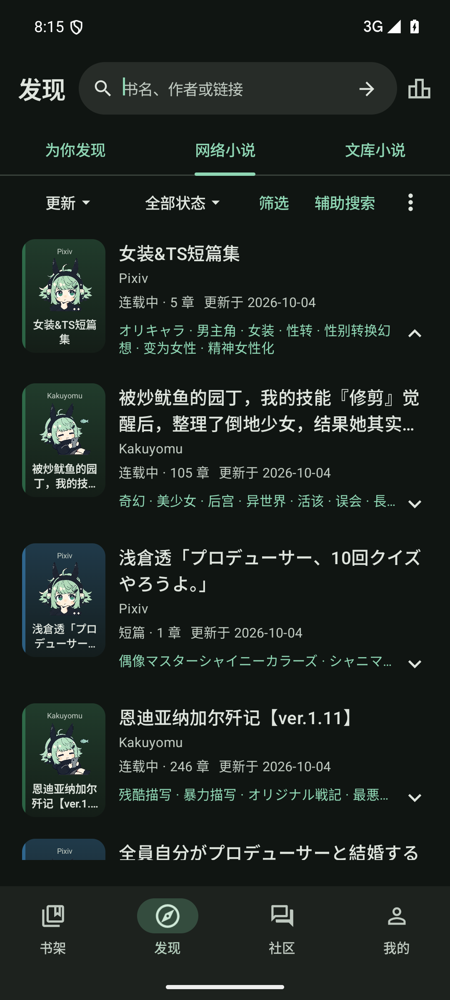
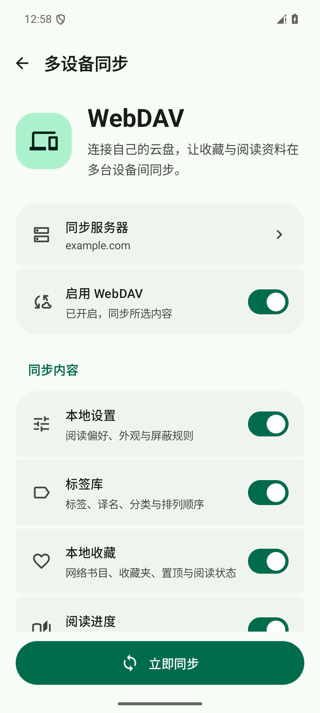

<div align="center">
  
  <h1>Novelia</h1>
  <p>
    面向 <a href="https://n.novelia.cc/">轻小说机翻机器人</a> 的原生 Android 客户端<br>
    在线阅读 · 本地书库 · 双语对照 · 多设备同步
  </p>
  <p>
    <a href="#下载与反馈"></a>
    
    
    <a href="LICENSE"></a>
  </p>
  <p>
    <a href="#屏幕截图">屏幕截图</a> ·
    <a href="#功能一览">功能一览</a> ·
    <a href="#使用">开始使用</a> ·
    <a href="docs/maintenance/troubleshooting.md">排障指南</a> ·
    <a href="docs/README.md">项目文档</a>
  </p>
  <a href="https://github.com/nobYoQ/novelia/releases">
    
  </a>
</div>

## 屏幕截图
<table align="center">
  <tr>
    <td align="center"></td>
    <td align="center"></td>
  </tr>
  <tr>
    <td align="center">多书源检索 · 标签筛选 · 排行榜</td>
    <td align="center">自选同步范围 · 连接自己的云盘</td>
  </tr>
</table>

<p align="center"><sub>应用界面截图；同步页面使用示例配置，界面可能随版本更新。</sub></p>

## 功能一览

| 功能 | 你可以做什么 |
| :--- | :--- |
| 📚 **整理书架** | 管理本地与云端收藏，按收藏夹归类、置顶、批量整理，查看阅读历史和更新。 |
| 🔎 **发现作品** | 浏览网络书源与文库，使用标签、字数筛选和高级搜索，保存常用搜索，接收书源链接分享。 |
| 📖 **自在阅读** | 在中文、日文与双语对照间切换，选择已有的 Sakura / GPT / 有道译文，支持译文回退、简繁显示和插图。 |
| 🎨 **按喜好调整** | 自定义字号、行距与纸张主题，切换深色、电子纸、滚动或分页模式，为单本书保存阅读偏好。 |
| 🎧 **随读随记** | 使用系统朗读、书签、摘录和笔记，缓存章节后继续阅读。 |
| 📂 **读本地文件** | 导入 EPUB / TXT / SRT，管理文库分卷，下载符合条件的已有译文，使用文件与文本工具。 |
| 💬 **参与社区** | 浏览论坛，阅读帖子和楼中楼，收藏文章、保存草稿，按账号权限发布与编辑。 |
| ☁️ **同步与备份** | 通过 WebDAV 按需同步网络书籍的收藏、进度、书签和笔记等资料；通过阅读资料备份迁移本地书库。 |

## 下载与反馈

**支持 Android 8.0（API 26）及以上。** 前往 [GitHub Releases](https://github.com/nobYoQ/novelia/releases) 下载 APK、查看发行说明与 SHA-256 校验文件。如果尚无可用发行版，可以 [从源码构建](#构建)。

- **版本与更新**：已发布版本以 Releases 为准，当前源码版本见 [version.properties](version.properties)。
- **预览版**：默认分支的成功构建自动更新 [Preview Pre-release](https://github.com/nobYoQ/novelia/releases/tag/preview)，仅构建 ARM64，可通过 [固定 APK 地址](https://github.com/nobYoQ/novelia/releases/download/preview/Novelia-preview-arm64-v8a.apk) 下载。任意分支的逐次构建产物仍在 [Actions → Preview APK](https://github.com/nobYoQ/novelia/actions/workflows/preview-apk.yml) 保留 14 天。构建、签名与发布说明见 [自动预览包](docs/development/getting-started.md#github-actions-自动预览包)。
- **安装与升级**：正式包与本地测试包的签名可能不同；更换安装来源前，请先完成 [阅读资料备份](docs/data/backup-and-recovery.md)。
- **问题与建议**：在 [Issues](https://github.com/nobYoQ/novelia/issues) 反馈客户端问题；原站内容、账号和权限问题请联系原站。

## 使用

安装后，可以先以游客身份浏览作品、阅读可访问的已有章节、导入本地文件和查看社区。

1. **发现一本书**：在「发现」中浏览、筛选或搜索，也可以粘贴受支持的书源链接。
2. **放进书架**：收藏喜欢的作品，或在「书架」导入 EPUB、TXT、SRT 文件。
3. **调好阅读体验**：打开正文，设置语言、译文、字号和主题；需要时添加书签、记笔记或开启朗读。
4. **接着读下去**：在「我的 → 设置」配置 WebDAV 同步，或导出阅读资料备份。

原站账号通过统一认证页面登录，支持注册和找回密码；认证后若未自动返回，点击右上角「完成登录」。独立论坛使用单独保存的登录会话，操作权限最终由服务器校验。详见 [账号与登录](docs/network/authentication.md)。

## 构建

使用 Android Studio 打开仓库根目录。准备 **JDK 17、Android SDK Platform 36、NDK 28.2.13676358、Go 1.27.1**；Go 和 NDK 用于构建应用依赖的 ECH 原生库，固定版本见 [工具链配置](gradle/ech-native.properties)。Windows x64 可自动引导所需 Go；其他系统需预装对应版本，或设置 `NOVELIA_GO_HOME`。SDK Build Tools 由 AGP 选择，项目没有显式固定其版本。

Windows 推荐使用 PowerShell 7，在仓库根目录执行：

```powershell
# 构建 Debug APK
./scripts/build-debug.ps1

# 构建本地 Release APK，同时运行单元测试和 Lint
./scripts/build-release.ps1 -Verify
```

本地 Release 使用测试证书签名，保留 R8 压缩与资源收缩。正式发行请遵循 [发布指南](docs/maintenance/releasing.md)。

<details>
<summary><strong>构建参数、输出位置与其他平台</strong></summary>

- 默认生成通用 APK；`-Abi arm64-v8a` 可限定设备架构。
- 已有完整依赖缓存时可加 `-Offline`；首次构建需要连接 Google Maven、Maven Central 和 Gradle 分发服务。
- `-Verify` 运行对应变体的 JVM 单元测试和 Lint，不运行设备测试。
- APK 与 SHA-256 校验文件位于 `outputs/packages/debug/` 或 `outputs/packages/release-local/`，日志位于 `outputs/logs/`；本地 Release 同时保留 R8 映射。重复构建会覆盖相同版本、模式和 ABI 的产物，不会自动安装或上传。
- 脚本自动查找 JDK / SDK；`./build.ps1 -CheckEnvironment` 只检查环境。完整路径优先级、手动配置及缓存目录见 [构建指南](docs/development/getting-started.md#自动检测与手动配置)。

Linux / macOS 使用 Gradle Wrapper：

```sh
sh ./gradlew --no-daemon :app:assembleDebug :app:testDebugUnitTest :app:lintDebug
```

直接调用 Gradle 的 `assembleRelease` 默认生成未签名产物。AGP、Gradle、Kotlin 与 Compose 版本见 [开发环境](docs/development/getting-started.md#开发环境)，ECH 构建逻辑见 [Gradle 配置](gradle/ech-native.gradle.kts)。

修改版本时，编辑根目录 [version.properties](version.properties) 中的 `versionName` 并递增 `versionCode`，再重新打包。具体操作见 [修改版本号并重新编译](docs/development/getting-started.md#修改版本号并重新编译)。

</details>

## 验证

构建时加 `-Verify` 可运行单元测试与 Lint。[Preview APK](.github/workflows/preview-apk.yml) 自动构建 Release 预览包及其依赖的 Go 单元测试。JVM 单元测试、完整 Lint、设备测试、只读站点联调和发行前检查仍按 [测试与验收](docs/quality/testing.md) 手动执行；外部站点测试默认跳过，正式发布仍手动执行。

## 工程结构

| 入口 | 阅读内容 |
| :--- | :--- |
| [文档总目录](docs/README.md) | 按开发、架构、功能、数据、网络、质量和维护分类查阅 |
| [源码目录导航](docs/architecture/source-layout.md) | 按界面、数据职责和测试类型定位代码 |
| [阅读器](docs/features/reader.md) | 双语、排版、分页、定位、插图与朗读 |
| [社区与内容编辑](docs/features/community.md) | 帖子、评论、Markdown、草稿及独立论坛适配 |
| [数据存储](docs/data/data-and-storage.md) | 本地文件、状态持久化和恢复边界 |
| [安全与隐私](docs/quality/security-and-privacy.md) | 会话加密、备份范围和网络数据处理 |

## 参与贡献

欢迎反馈问题、完善文档或提交代码。开始前请阅读 [贡献指南](.github/CONTRIBUTING.md) 与 [行为准则](.github/CODE_OF_CONDUCT.md)；安全问题按 [安全政策](.github/SECURITY.md) 报告。

## 许可证与范围

原创代码和文档采用 [GPL-3.0-only](LICENSE)。第三方依赖、角色素材及网站上的小说、封面、译文和用户内容保留各自权利，不属于本项目的内容再授权范围，详见 [来源与素材声明](NOTICE.md) 与 [许可证来源](licenses/README.md)。完整开源许可证也可在 App 的「我的 → 帮助与关于 → 开源许可证」离线查看。

感谢 [轻小说机翻机器人](https://n.novelia.cc/) 与开源社区提供的基础。愿你总能找到下一本想读的书。
