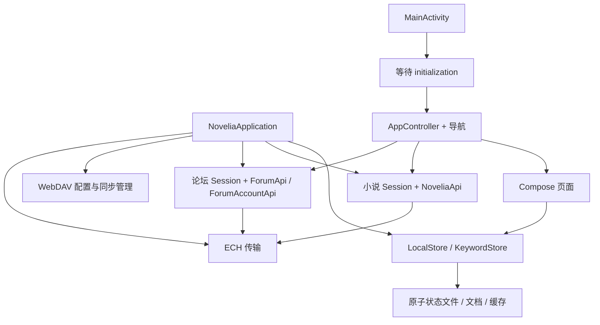

# 架构与状态流

[架构目录](README.md) · [文档首页](../README.md)

Novelia 的业务代码主要在一个 Android 模块 `app` 中，另有性能采集模块 `benchmark` 和 Go 编写的 ECH 原生库。它没有服务端，也没有用 Room 存储书架。理解这个项目的关键是：**应用级服务管理长期数据，页面负责交互，控制器把两者接起来。**

## 主要对象分别负责什么

| 对象 | 职责 | 生命周期 |
| --- | --- | --- |
| [NoveliaApplication](../../app/src/main/java/cc/novelia/app/NoveliaApplication.kt) | 装配存储、会话、API、书源、ECH、WebDAV 和后台调度 | 应用进程 |
| [LocalStore](../../app/src/main/java/cc/novelia/app/data/storage/LocalStore.kt) | 书架、位置、笔记、草稿等状态，及文档/缓存访问 | 应用进程；资料落盘 |
| [Session](../../app/src/main/java/cc/novelia/app/data/auth/Session.kt) | 当前令牌、账号、登录代次及书源绑定 | 应用进程；凭据加密保存 |
| [AppController](../../app/src/main/java/cc/novelia/app/ui/navigation/AppController.kt) | 导航、错误提示、登录续接、章节读取和部分业务协调 | Compose 根树，**不是 ViewModel** |
| Compose 页面 | 展示状态、处理输入、管理页面请求和弹窗 | 页面组合 |
| WorkManager Worker | 云端待办、更新检查、文件下载、WebDAV 同步 | 可跨进程重新调度 |

`LocalStore` 使用 JSON 和文件保存资料；WorkManager、WebView 仍可有自己的数据库。部分业务代码目前留在页面里，新增改动应沿现有边界拆出可测试的规则，不必先引入一套新架构。

## 启动与依赖

`initialization` 在 IO 作用域初始化书库和小说会话；Activity 等待完成再进入导航。若书库读取损坏，界面先进入恢复流程，不能把空状态当成正常书架继续写入。

小说会话和论坛会话分开装配，分别保存原站与镜像的凭据。两者共用书源线路拦截器，线路切换后恢复对应会话并使旧请求失效。WebDAV 使用自己的服务器配置和客户端，不借用原站认证。详见[网络与同步](../network/network-and-sync.md)。

Application 监听前后台、偏好及待办变化，安排持久化和 Worker。标签初始化等非首屏工作延后执行。页面的一次重组不应成为后台任务的启动入口。

## 从一次操作看状态如何流动

### 收藏一本书

页面用 `BookRef(provider, id)` 标识书籍，稳定键是 `provider/id`。本地收藏通过 `LocalStore.update` 更新不可变快照，`StateFlow` 立即通知页面，文件稍后合并写入。需要确认数据落盘时等待 `flush()`，不能从 UI 已更新推断写盘成功。

云端收藏则捕获当前会话，通过 `cloudMutation` 记录允许重放的意图并尝试发送。待办属于发起账号，后台任务发送前先确认它已落盘。发帖、评论等直接请求不走这套队列。完整规则见[同步策略](../network/network-and-sync.md#哪些操作可以离线排队)。

### 打开并阅读一章

`BookRef + chapterId` → `AppController.chapter` → 本地文档，或章节缓存/网络 → `Chapter` → 阅读文本投影 → 滚动或分页布局 → 保存阅读锚点。

`Chapter` 保存原始内容，显示语言和引擎选择产生另一份投影，不能修改原始章节。章节 ID、原文段落、显示列表下标和屏幕页码用途不同，见[阅读器](../features/reader.md)。

### 等待一个账号请求

请求开始时捕获 `SessionBinding(account, generation, source, sourceRevision)`，取令牌和提交结果时再次核对。用户退出、重新登录或切换书源后，旧结果必须失效。元数据缓存还需检查自己的失效时间和缓存代次；“HTTP 成功”不足以证明响应仍能写回当前页面。

### 导入或恢复文件

文件 URI → 有界读取和暂存 → 解析/校验 → 安装文档文件 → 提交书库引用。恢复 ZIP 还多了预览、重新校验、冲突合并和失败回滚，见[备份与恢复](../data/backup-and-recovery.md)。不要通过直接覆盖 `library.json` 模拟恢复。

## 状态应该放在哪里

- **持久阅读资料**放 `LocalStore`；标签库由 `KeywordStore` 独立保存。书源选择、桌面图标和 WebDAV 凭据有自己的设备配置。
- **账号凭据**交给 `Session`，不放进书库或备份。设备书架由各账号共享，退出不会删除它。
- **页内输入、展开状态、滚动位置**用 Compose 状态，按需要使用 `rememberSaveable`；草稿另走持久化。
- **跨进程待执行任务**使用已有持久队列或 Worker；`AppController.afterLogin` 只是临时回调。

I/O 放在 IO 调度器，投影和排版等计算按现有实现放在 Default。捕获异常时继续传播取消。电子纸和减少动效会影响手势、列表和弹层，不能只改颜色。

继续阅读：[源码导航](source-layout.md) · [界面与导航](ui-and-navigation.md) · [数据存储](../data/data-and-storage.md)。
