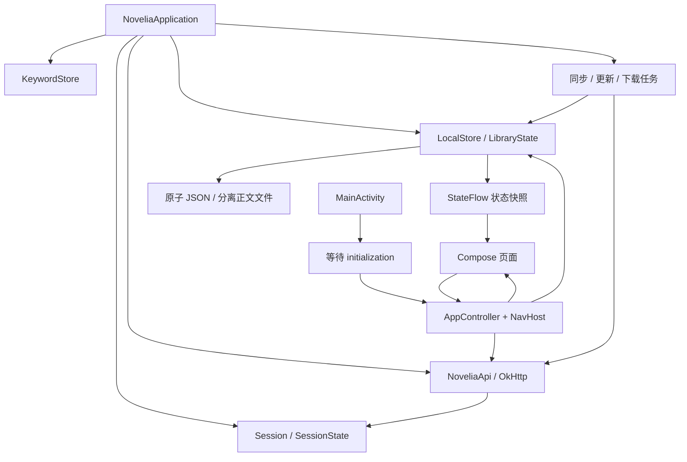

# 架构与代码地图

[返回架构与界面索引](README.md) · [文档总目录](../README.md)

## 模块与责任

本文按代码和状态归属解释架构；按用户操作阅读流程请使用[业务功能索引](../features/README.md)。例如“继续阅读”跨越[书架](../features/library.md)、[书籍详情](../features/book-details.md)与[阅读器](../features/reader.md)，而它们共享同一个本地资料服务。

工程是一个 Android 应用模块加一个独立的性能测试模块。应用内部按包和文件划分责任，没有单独的服务端、Room 数据库模块或依赖注入框架；页面通过共享控制器访问应用服务，部分业务操作仍位于页面中。理解这一现状有助于在已有边界内实现小步改进。

| 目录 | 责任 | 主要入口 |
| --- | --- | --- |
| `app/src/main/java/cc/novelia/app` | Application、Activity、生命周期与导航装配 | [NoveliaApplication.kt](../../app/src/main/java/cc/novelia/app/NoveliaApplication.kt)、[MainActivity.kt](../../app/src/main/java/cc/novelia/app/MainActivity.kt) |
| `data/` | 按 13 个职责包组织 DTO、持久状态、会话、HTTP、同步与缓存 | [model/](../../app/src/main/java/cc/novelia/app/data/model)、[LocalStore.kt](../../app/src/main/java/cc/novelia/app/data/storage/LocalStore.kt)、[NoveliaApi.kt](../../app/src/main/java/cc/novelia/app/data/network/NoveliaApi.kt) |
| `ui/` | 按功能划分的 Compose 页面，以及导航、共享组件、主题、Markdown/WebView 桥接 | [源码目录导航](source-layout.md)、[AppController.kt](../../app/src/main/java/cc/novelia/app/ui/navigation/AppController.kt)、[Screen.kt](../../app/src/main/java/cc/novelia/app/ui/components/Screen.kt) |
| `reader/` | 阅读投影、锚点、静态分页、搜索、系统 TTS | [Paragraphs.kt](../../app/src/main/java/cc/novelia/app/reader/Paragraphs.kt)、[ReadAloudService.kt](../../app/src/main/java/cc/novelia/app/reader/ReadAloudService.kt) |
| `files/` | 文件解析、转换、下载、导出和清理 | [EpubReader.kt](../../app/src/main/java/cc/novelia/app/files/EpubReader.kt)、[DownloadWorker.kt](../../app/src/main/java/cc/novelia/app/files/DownloadWorker.kt) |
| `app/src/test/` | JVM 单元和本地 HTTP 合约测试 | [测试指南](../quality/testing.md) |
| `app/src/androidTest/` | 设备 UI、文件、排版和可选站点测试 | [测试指南](../quality/testing.md) |
| `benchmark/` | Macrobenchmark 和 Baseline Profile 采集 | [性能指南](../quality/performance.md) |
| `gradle/`、`scripts/` | Wrapper、许可生成、手动发行附件 | [发布维护](../maintenance/release-and-maintenance.md) |

`app` 依赖 `benchmark` 作为 Baseline Profile 的生成来源，但 `benchmark` 不是应用运行时库。自动 profile 生成默认关闭。

`ui/` 使用 17 个子包组织源码，目录与 Kotlin package 一致。`shelf`、`discover`、`book`、`reader`、`community` 等功能包各自保留页面与专用组件；`components`、`navigation`、`theme`、`markdown`、`feedback` 承担跨界面职责。这些是同一 Gradle 模块内的源码边界，不是独立构建模块。阅读器的 Compose 界面位于 `ui/reader/`，正文投影、搜索和 TTS 等核心实现仍位于顶层 `reader/`。

## 启动与状态流

`NoveliaApplication` 持有应用级 `SupervisorJob + Dispatchers.IO` 协程作用域，惰性创建 `LocalStore`、`Session`、`KeywordStore` 和 `NoveliaApi`。`initialization` 提前初始化书库与会话；`MainActivity` 等待它结束后才进入主导航。首次绘制的报告也受这个初始化状态控制。

启动后的独立任务观察自动同步和更新提醒设置、处理待同步调度、清理下载临时文件及已退役模型。标签观测延后启动，避免阻塞首次打开书库。任务的真实入口在 [Application](../../app/src/main/java/cc/novelia/app/NoveliaApplication.kt)，不要把后台任务绑定到某个页面的一次重组。

`MainActivity` 使用 Compose Navigation 建立四个根入口：书架、发现、社区、我的。`AppController` 负责导航、错误消息、登录后继续、章节读取、详情缓存及部分云端操作。它由 `remember` 创建并持有组合范围的协程作用域，并不是 ViewModel；不要假定其临时回调或字段能跨进程重建。

持久状态通过 `LocalStore.update` 改变；Compose 观察 `StateFlow`。页面内临时选择和弹窗状态由 Compose 状态保存。`MainActivity.onStop` 请求刷新待写入数据，持久化机制仍有自身的批处理和错误处理；不能只依赖 Activity 停止时的一次写入保证事务。

## 四条关键数据流

### 打开书籍与章节

系统链接/分享文本或列表点击 → `BookLinks`/`AppController` → 书籍详情或阅读路由。网络小说章节经章节请求共享与缓存读取，本地文件则从本地目录索引和正文文件读取；结果交给阅读器投影、分页和进度逻辑。完整过程见 [阅读器](../features/reader.md)。

书目身份使用 `BookRef(provider, id)`，稳定键为 `provider/id`。`wenku` 与 `local` 为特殊类型，其他类型来自 `providers`。书名和列表位置都不能替代稳定身份；文库父条目与导入的本地分卷也不能混成同一个对象。

### 认证后的网络读取

页面发起请求 → 捕获 `SessionBinding` → `NoveliaApi` 按绑定读取令牌 → HTTP 响应 → 再检查会话是否仍相同 → 解码/更新状态。绑定包含账号和登录代次，防止退出再登录或切换账号后接收旧请求结果。缓存还有自己的变更时间和代次，不能只判断网络请求成功。见 [网络与同步](../network/network-and-sync.md)。

### 离线云端意图

允许排队的云端操作 → 账号隔离的 `PendingAction` → 记录本地意图并排队落盘 → 前台发送 → 成功移除/失败记录。前台发送前不会等待每次意图落盘；后台调度会先等待 `flush()`，再由 WorkManager 重放。并非所有写接口都能排队；帖子和评论等非幂等操作不能套用自动重发。后台任务与前台页面共享同步策略，见 [同步策略](../network/network-and-sync.md)。

### 导入、下载与恢复

用户选择 URI 或下载任务 → 有界读取/临时文件 → 解析与验证 → 文档存储/索引 → 书架状态引用。阅读资料 ZIP 备份还涉及版本、清单、校验和恢复提交；不能用“覆盖书库 JSON”代替完整恢复。见 [文件处理](../features/files-and-downloads.md) 与 [数据备份](../data/data-and-storage.md)。

## 功能定位表

| 需求 | 首先查看 |
| --- | --- |
| 本地/云端书架、收藏夹、分卷 | [AdaptiveLibrary.kt](../../app/src/main/java/cc/novelia/app/ui/shelf/AdaptiveLibrary.kt)、[CloudShelf.kt](../../app/src/main/java/cc/novelia/app/ui/shelf/CloudShelf.kt)、[WenkuVolumes.kt](../../app/src/main/java/cc/novelia/app/data/library/WenkuVolumes.kt) |
| 发现、排行榜、筛选、查询表达式 | [DiscoverScreen.kt](../../app/src/main/java/cc/novelia/app/ui/discover/DiscoverScreen.kt)、[RankScreen.kt](../../app/src/main/java/cc/novelia/app/ui/discover/RankScreen.kt)、[SearchExpression.kt](../../app/src/main/java/cc/novelia/app/data/catalog/SearchExpression.kt)、[SearchAssistantPanel.kt](../../app/src/main/java/cc/novelia/app/ui/discover/SearchAssistantPanel.kt) |
| 书籍详情、文库编辑、术语 | [BookScreen.kt](../../app/src/main/java/cc/novelia/app/ui/book/BookScreen.kt)、[WenkuEditor.kt](../../app/src/main/java/cc/novelia/app/ui/book/WenkuEditor.kt)、[GlossaryScreen.kt](../../app/src/main/java/cc/novelia/app/ui/book/GlossaryScreen.kt) |
| 社区列表与文章 | [CommunityScreen.kt](../../app/src/main/java/cc/novelia/app/ui/community/CommunityScreen.kt)、[ArticleScreen.kt](../../app/src/main/java/cc/novelia/app/ui/community/ArticleScreen.kt) |
| 发帖、评论、草稿 | [ComposeArticleScreen.kt](../../app/src/main/java/cc/novelia/app/ui/community/ComposeArticleScreen.kt)、[CommentsPanel.kt](../../app/src/main/java/cc/novelia/app/ui/community/CommentsPanel.kt)、[EditorDraft.kt](../../app/src/main/java/cc/novelia/app/ui/markdown/EditorDraft.kt) |
| 阅读偏好与设置 | [SettingsScreen.kt](../../app/src/main/java/cc/novelia/app/ui/settings/SettingsScreen.kt)、[ReaderPreferences.kt](../../app/src/main/java/cc/novelia/app/ui/reader/ReaderPreferences.kt) |
| 账号、登录与帮助 | [ProfileScreen.kt](../../app/src/main/java/cc/novelia/app/ui/account/ProfileScreen.kt)、[LoginScreen.kt](../../app/src/main/java/cc/novelia/app/ui/account/LoginScreen.kt)、[AboutScreen.kt](../../app/src/main/java/cc/novelia/app/ui/about/AboutScreen.kt) |
| 更新检查与提醒 | [BookUpdates.kt](../../app/src/main/java/cc/novelia/app/data/updates/BookUpdates.kt)、[UpdateWorker.kt](../../app/src/main/java/cc/novelia/app/data/updates/UpdateWorker.kt)、[UpdateCheckOrder.kt](../../app/src/main/java/cc/novelia/app/data/updates/UpdateCheckOrder.kt) |
| 备份与损坏恢复 | [LibraryBackupScreen.kt](../../app/src/main/java/cc/novelia/app/ui/settings/LibraryBackupScreen.kt)、[LibraryBackupService.kt](../../app/src/main/java/cc/novelia/app/data/backup/LibraryBackupService.kt)、[LibraryRecovery.kt](../../app/src/main/java/cc/novelia/app/data/storage/LibraryRecovery.kt) |

## 需要保持的边界

- 网络和文件 I/O 离开主线程；正文投影等较重计算在适合的调度器完成，协程取消必须继续传播。
- 令牌属于 `Session`，阅读数据属于 `LocalStore`，普通设置导出不包含会话或待同步操作。
- 账号绑定、缓存代次与本地书目身份是不同概念，不能用其中一个替代另一个。
- 电子纸和减少动效是跨页面交互约束，不只是主题配色开关。
- 服务端决定实际权限；客户端的角色和注册时间判断只用于界面提示与提前拦截。
- 新功能沿用现有入口，复杂纯逻辑可抽到独立 Kotlin 文件并增加边界测试；不要借一个小改动重写全部架构。

具体扩展步骤见 [日常开发](../development/development.md)，验证范围见 [测试](../quality/testing.md)。
