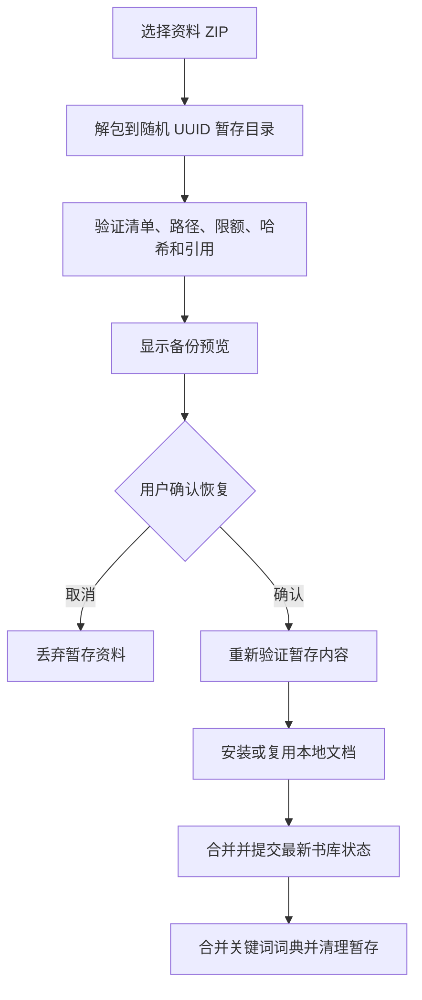

# 阅读资料备份与恢复

[返回数据与存储索引](README.md) · [文档总目录](../README.md)

完整阅读资料备份用于换机、重装前保留资料，以及在明确确认后合并恢复。界面入口是 [LibraryBackupScreen.kt](../../app/src/main/java/cc/novelia/app/ui/settings/LibraryBackupScreen.kt)，实现分为 [LibraryBackupService.kt](../../app/src/main/java/cc/novelia/app/data/backup/LibraryBackupService.kt) 和 [LibraryBackupArchive.kt](../../app/src/main/java/cc/novelia/app/data/backup/LibraryBackupArchive.kt)。常规状态文件与持久化顺序见[数据存储](data-and-storage.md)。

## 1. 先选择正确的迁移方式

| 需求 | 应使用的功能 | 不能据此假定的内容 |
| --- | --- | --- |
| 复制部分阅读、主题和过滤设置 | 普通设置 JSON | 不包含书架、笔记、本地小说或单书偏好 |
| 分享或迁移标签原文、译名与分类 | 标签库 JSON | 是本地词典，不包含全站标签或作品数据 |
| 保存完整阅读资料 | 阅读资料 ZIP | 不包含登录凭据、全部缓存或后台运行任务 |
| 在账号中同步收藏/阅读章节 | 云端同步 | 不是本地文档、笔记和草稿的整库备份 |
| 导出某一本小说文件 | 文件导出/系统文件选择器 | 不包含整套书架资料 |

卸载或更换签名安装之前，应完成导出，并在可用环境中通过备份预览核对可读性及内容。应用在配置中禁用系统自动备份，不应假设重装后系统会恢复全部私有目录。

## 2. 包含与排除的数据

阅读资料 ZIP 包含书架、分组、阅读进度、笔记、收藏文章、草稿、阅读偏好、屏蔽与搜索资料、本地文档及插图、文库分卷关联、个人术语表、关键词词典等。可选择携带仍可用的 EPUB/TXT/SRT 原文件。

导出时通过 `forBackup()` 清空以下运行状态：

- 云端待同步操作 `pending`；
- 下载任务记录 `downloads`；
- 云端同步运行状态 `syncStatus`。

访问令牌、WebView Cookie、网络章节缓存、元数据缓存和 Coil 缓存不包含在这个 ZIP 中。下载成品需要先导入为本地文档，才会按本地文档规则进入备份；单独留在下载目录中的文件不能靠资料备份迁移。

备份使用哈希检查完整性，但没有应用层加密或发布者签名。用户导出后的文件可能包含阅读历史、笔记和草稿，应按个人资料保管，不能作为真实内容测试夹具提交到仓库。

## 3. 导出流程

1. 等待书库和关键词词典持久化，减少仅存在内存中的修改。
2. 取得阅读资料快照并移除运行态任务。
3. 读取本地文档，导出包含完整章节正文的便携 JSON；运行时 `chapterFiles` 分块映射不直接作为跨设备格式。
4. 单独收集文档图片、封面及可选原件，计算长度和 SHA-256。
5. 生成 `manifest.json` 并写入 ZIP，结束时清理导出临时文件。

清单标识为 `format = "novelia-library"`、`version = 1`，记录创建时间、资料快照、文档、缺失文档、原件选项、关键词和资源索引。

标签分类（包括空分类）保存于可选字段 `keywordCategories`，标签的 `categoryEdited` 标记用于保留本机归类修改。旧备份缺少分类字段时从旧标签记录和默认分类恢复，仍可导入。

无法找到的文档会进入 `missingDocuments`，不能在说明中宣称这些正文已备份。文档引用的必要图片缺失等错误会使导出失败，而不是生成看似完整但不可恢复的资源集。预览时应核对缺失提示；导出成功不等于源设备从来没有缺失资料。

## 4. 导入、预览与确认

`prepare(input)` 完成解包及初次验证，UI 仅保留暂存 UUID。`preview(stagingId)` 和 `restore(stagingId)` 会再次验证，不把上次成功校验当成永久可信结果。暂存 ID 不能替换为调用方传入的任意磁盘路径。

恢复操作串行执行。在真正提交时，合并基于**当时最新**的设备状态，避免用户停留预览页期间的新阅读进度、笔记或书架修改被旧快照覆盖。

## 5. 冲突与合并规则

| 数据 | 合并规则 |
| --- | --- |
| 已有网络书籍 | 当前设备项优先，加入缺失项 |
| 阅读进度 | 同一书籍比较 `updatedAt`，保留更新的记录 |
| 笔记、收藏文章 | 按 ID 合并，冲突保留当前记录 |
| 草稿、单书设置、个人术语 | 当前设备对应值优先 |
| 屏蔽、分组、旧保存搜索 | 合并去重；最近搜索有数量限制 |
| 命名搜索组合 | 保留来源、状态、译文、关键词、排序与分级，按 ID 合并，同 ID 保留本机内容 |
| 标签词典和分类 | 原文去重、同名分类合并，本机已编辑的译名和归类优先；未编辑的默认值可补充 |
| 默认偏好 | 当前书架、进度和笔记均为空时才采用导入资料的相应默认偏好 |
| 本地文档 | 完整内容与图片一致时复用，否则新建 ID 并重映射引用 |
| 当前下载/同步任务 | 保留本安装已有状态，不从备份注入任务 |

“当前资料为空”的判断有明确字段条件，不等于设备所有设置都没被用户改过。恢复不是全盘覆盖，也不是按文件名替换。

### 本地文档如何避免误复用

源文件哈希只用于缩小候选范围。服务还会检查候选文档可完整读取，并比较格式、章节、封面和图片摘要。源哈希相同但正文损坏的现有文档不能被当成可用副本。

需要新建文档时使用新 ID，随后重映射书籍、阅读进度、笔记、单书设置、术语、屏蔽及文库父子/排序引用。复用文档时可以补充缺失原件，但不会覆盖已有原件。跨设备不可用的绝对封面路径会在恢复过程中重建。

## 6. 校验与限额

| 项目 | 当前限制或规则 |
| --- | --- |
| 清单 | 最大 16 MiB，格式和版本必须支持 |
| 单资源 | 最大 128 MiB |
| ZIP 解压总量 | 最大 1 GiB，按实际读取字节累计 |
| ZIP 项数 | 最多 30000 |
| 路径 | 仅接受规定的清单、文档、原件和图片路径，拒绝目录项、重复路径及越界路径 |
| 文件完整性 | 实际长度及 SHA-256 与清单一致 |
| 资源引用 | 解包资源、清单资源及文档实际引用必须相符，拒绝额外未引用资源 |
| 数据约束 | 检查文档/章节标识、设置范围、非负进度、分卷关系和词典规模等 |

这些是完整备份的限制，与单本文件导入、EPUB 解压、下载和文库上传限制不同。调整限额时应核对所有相关入口，避免一个入口允许生成另一个入口永远无法读取的产物。

校验失败时保留原始备份供排查，不跳过哈希或路径校验强行恢复。哈希相符只能说明内容与清单匹配，不能证明内容来自可信作者。

## 7. 失败、取消与部分成功

恢复按“安装文件 → 提交书库 → 合并关键词”的顺序进行：

| 失败阶段 | 处理语义 |
| --- | --- |
| 解包或初次校验 | 清理本次暂存，当前书库不进入提交 |
| 安装文件后、书库提交前 | 回滚本次新安装的文件，保留原有资料 |
| 书库提交中 | 关键提交使用不可取消边界，避免磁盘已成功而内存状态未切换 |
| 书库已提交、关键词保存失败 | 书库恢复已成功，返回警告并保留暂存供重试 |

不可取消范围只保护关键提交，不应把整个文件解包都变为不可取消操作。部分成功不能显示成“所有资料恢复失败”，也不能再次覆盖用户已经恢复后修改的数据。

## 8. 启动时发现资料损坏

[LibraryRecovery.kt](../../app/src/main/java/cc/novelia/app/data/storage/LibraryRecovery.kt) 区分首次安装与已有资料读取失败。主文件损坏后可以尝试最后良好副本，但无论回退是否成功，应用都会进入保护状态，阻止普通更新和文档修改覆盖可抢救资料。

用户通过现有恢复入口确认后，`commitRestore` 才提交状态。恢复前会保留损坏主文件，强制写入长文本载荷，并使恢复前排队的旧快照失效。不要用写入空 `LibraryState`、清缓存或卸载来代替这套流程。

出现此问题时应记录失败阶段、版本和存储空间等信息，保留原备份及受保护资料；公开反馈只提供脱敏错误，不附真实完整书库。

## 9. 维护与回归入口

新增备份字段或文件类型，需要同步更新导出收集、路径白名单、模型验证、引用完整性检查、合并与重映射规则、预览和失败清理。只让 JSON 能反序列化不足以完成格式兼容。

优先阅读 [LibraryBackupTest](../../app/src/test/java/cc/novelia/app/data/backup/LibraryBackupTest.kt)、[LibraryStateCodecTest](../../app/src/test/java/cc/novelia/app/data/storage/LibraryStateCodecTest.kt)、[DocumentStorageTest](../../app/src/test/java/cc/novelia/app/data/documents/DocumentStorageTest.kt) 和设备侧 [LibraryBackupFlowTest](../../app/src/androidTest/java/cc/novelia/app/data/backup/LibraryBackupFlowTest.kt)。关键场景包括缺失资源、恶意路径、限额、哈希错误、相同源文件但现有内容损坏、预览期间状态更新、取消与关键词部分失败。
