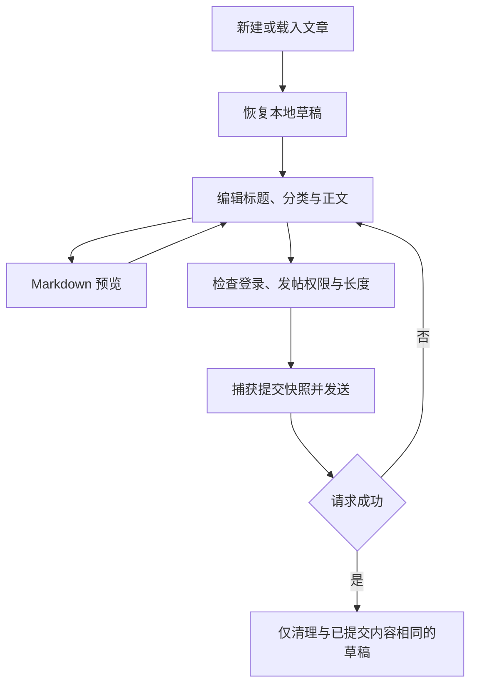

# 社区、评论与内容编辑

[返回业务功能索引](README.md) · [文档总目录](../README.md)

社区功能包括帖子列表、文章正文、评论与回复、本地收藏、Markdown 编辑和草稿恢复。主要代码在 [ui/community](../../app/src/main/java/cc/novelia/app/ui/community) 与 [ui/markdown](../../app/src/main/java/cc/novelia/app/ui/markdown)。登录流程见[账号与登录](../network/authentication.md)。

本预览分支的社区入口使用独立论坛，接口版本、权限规则和验证记录见[独立论坛 API 预适配](../network/forum-api-preview.md)。旧站文章及小说评论仍使用主站接口，两边的登录和退出相互独立。

## 1. 浏览范围与收藏

[CommunityScreen.kt](../../app/src/main/java/cc/novelia/app/ui/community/CommunityScreen.kt) 从服务器加载分类，按站务公告、小说讨论、意见反馈的顺序展示，首次进入默认打开站务公告。在线列表按服务端分页加载，每页 20 条，并支持最近活跃、最新发布、浏览最多、评论最多四种排序。

| 操作 | 实际数据范围 |
| --- | --- |
| 切换社区分类/页码 | 请求所选分类与页码的帖子列表 |
| 在全部帖子中输入搜索词 | 将 `q` 发送给服务器，在所选分类内搜索 |
| 在我的帖子／云端收藏中输入搜索词 | 筛选当前页的帖子标题 |
| 切换本地收藏列表 | 读取本设备 `savedArticles` |
| 切换云端收藏／我的帖子 | 使用独立论坛会话读取对应分页接口 |
| 屏蔽用户 | 在客户端隐藏相应列表或评论内容，不修改服务端账号关系 |

收藏文章会保存文章资料与正文到本地状态，长正文由持久化层单独存储。当前文章详情页仍会加载远端详情，因此不能由“收藏里保存了正文”推导出所有文章入口都支持离线打开。换机需要保留收藏时，应使用[完整阅读资料备份](../data/backup-and-recovery.md)。

[ArticleScreen.kt](../../app/src/main/java/cc/novelia/app/ui/community/ArticleScreen.kt) 负责文章正文、讨论入口、收藏以及编辑/删除入口。论坛按用户 ID 和角色判断权限，普通作者仅能在发帖后 20 分钟内删除，管理员不受时限影响；旧站文章仍按用户名显示作者操作。服务端负责最终权限校验。删除文章会发送远端请求，与移除本地收藏不同。

## 2. 帖子编辑与提交

[ComposeArticleScreen.kt](../../app/src/main/java/cc/novelia/app/ui/community/ComposeArticleScreen.kt) 对新建和编辑使用同一编辑流程。

论坛标题要求 2～100 个 Unicode 码点，正文为 1～20000，标签最多 3 个；规则集中在 [ForumRules.kt](../../app/src/main/java/cc/novelia/app/data/model/ForumRules.kt)。旧站文章仍要求标题 2～80 字符、正文 2～20000 字符。论坛超长草稿保留内容并提示缩短，不截断正文。界面输入限制不能替代服务端校验。

未满足发帖权限时，用户仍可以编辑、预览并保留草稿；提交阶段再次判断登录及所属站点的发布权限。论坛允许 `member`、`trusted`、`admin` 发言，但站务公告仅管理员可发布。发送时保存提交快照，避免将请求发起后的输入误认为已经发布。

社区的“新建帖子草稿”和“新帖草稿箱”入口不要求登录。草稿箱可同时保留多篇新帖，按标题和所属站点识别、续写或删除；旧站草稿可离线续写，论坛编辑器进入时仍需加载远端分类与标签。旧站草稿继续使用主站编辑器，不会自动迁移或发布到论坛。发布仍沿用所属站点的登录和权限检查，不会自动排队发送。

论坛新建使用 `POST post/`，修改使用 `PATCH post/{id}/`；旧站草稿发布使用 `POST article`，文章修改保留 `PUT article/{id}`。这些请求直接发送，不加入云端收藏和阅读进度的离线队列。请求失败应保留草稿并展示错误；如果出现“响应失败但服务端可能已接收”的情况，先核对远端文章再重试，不能默认安全地重复新建。

## 3. 草稿生命周期

| 草稿类型 | 键 | 保存内容 |
| --- | --- | --- |
| 新论坛帖子 | `article:forum-new:<UUID>` | 每篇独立保存标题、分类 ID、正文、标签 ID；兼容旧 `article:forum-new` |
| 旧站新帖草稿 | `article:new:<UUID>` / `article:new` | 原草稿保留，继续使用主站编辑器，不自动发布到论坛 |
| 已有帖子 | `article:{id}` | 对应文章的编辑内容 |
| 评论/回复 | `comment:{site}:{parent}` | 当前评论目标的文本 |
| 论坛评论/回复 | `forum-comment:{postId}:{userId或guest}:{root或回复根ID或edit-ID}` | 当前论坛账号与评论目标的文本 |
| 文库资料 | `wenku:new` / `wenku:{id}` | 文库表单，详见[书籍详情](book-details.md) |

草稿属于设备共享的 `LibraryState.drafts`。论坛评论键包含用户 ID，帖子和主站评论键没有账号前缀。退出登录不会自动清除这些资料，切换账号后仍需核对提交目标与内容。

文章编辑采用约 700 ms 防抖保存，同时通过 [EditorDraft.kt](../../app/src/main/java/cc/novelia/app/ui/markdown/EditorDraft.kt) 处理页面离开时的最新内容。编辑/预览切换、Compose 重组与状态恢复都需要保留输入；不能只依赖 `remember` 中的临时文本。

“保存草稿并退出”会等待本地持久化完成后返回；保存失败时保留编辑器和内容，并显示持久化错误。新帖成功发布只清理对应草稿，其他新帖不受影响。旧版固定草稿会出现在草稿箱，可按原内容继续编辑。

提交成功后的清理是有条件的：当前内容仍等于已发送快照才清除，否则保存新内容。新增编辑器时应沿用这套逻辑，避免用户在慢请求期间继续输入后丢失草稿。

## 4. 评论与回复

[ForumCommentsPanel.kt](../../app/src/main/java/cc/novelia/app/ui/community/ForumCommentsPanel.kt) 使用论坛帖子下的平铺分页评论接口，回复传根评论 `rootId`，修改只传 `content`。评论最多 1000 个 Unicode 码点；普通作者发布后 20 分钟内可编辑或删除，管理员不受时限限制，并可展开隐藏／删除评论的原文。帖子和评论表单均提供 `/rules` 社区守则入口。

[CommentsPanel.kt](../../app/src/main/java/cc/novelia/app/ui/community/CommentsPanel.kt) 继续服务于主站作品和旧文章评论。调用方提供 `site` 与父目标，不应只凭显示标题推断评论归属。以下为主站评论行为：

- 列表请求为 `GET comment`，查询参数包括 `site`、`page`、`pageSize` 和 `parentId`，每页 20 条。
- 发送请求为 `POST comment`，请求体中的父目标字段叫 `parent`，与读取参数 `parentId` 不同。
- 一级列表展示未被屏蔽的回复摘要，最多取两条；完整回复在回复面板中继续加载。
- 内容隐藏状态显示相应提示；被本地屏蔽用户的评论及摘要会被过滤。
- 锁定讨论限制发送入口，但不等于不能查看已有内容。
- 评论的更多菜单提供删除自己的评论或屏蔽其他用户；屏蔽是本地操作，并在当前评论面板显示“撤销”，回复面板同样可撤销。删除确认按钮标明“删除评论”或“删除文章”。

评论输入持续保存到对应草稿键。发送成功后，只有当前输入仍与发送文本相同才清空。删除、发送均是直接远端请求，不应对所有 HTTP 失败统一套用离线重放。

## 5. Markdown 渲染与链接

渲染入口是 [MarkdownText.kt](../../app/src/main/java/cc/novelia/app/ui/markdown/MarkdownText.kt)，站点扩展语法由 [SiteMarkdownParser.kt](../../app/src/main/java/cc/novelia/app/ui/markdown/SiteMarkdownParser.kt) 处理。工具栏、模板插入与预览应使用相同语义，防止“编辑器里看到的”和最终正文不一致。

维护时尤其注意：

1. 围栏代码块中的内容应作为代码保留，不能用全局字符串替换处理星号、链接或站点扩展标记。
2. 自动链接处理基于解析结构，已有链接和图片节点不能再次包装成链接。
3. 折叠详情、删除线等站点扩展需要覆盖嵌套、闭合和未闭合输入。
4. 站内书籍/文章链接、站点 WebView 页面和外部浏览器链接由各自入口处理；渲染器不直接拼装任意导航路由。

旧原站域名 `books.fishhawk.top` 会转换为 `https://n.novelia.cc`，正文裸链接、表格中的 Markdown 链接及分享入口采用相同的域名映射。书籍、章节和文章优先进入原生页面；带跨文档锚点或没有原生对应页的链接由站内 WebView 承接，保留原始查询参数与锚点。仅识别明确的站点域名，不会仅因外站路径含有 `/novel/` 就将其改写。裸链接后的中英文混用括号说明（如 `URL(说明）`）会留在正文中，不再作为 URL 的一部分。

更完整的组件约束、Markdown 能力和 WebView 边界见 [UI 与导航](../architecture/ui-and-navigation.md)。

## 6. 维护与验证

| 场景 | 要检查的结果 |
| --- | --- |
| 列表搜索后翻页 | 全部帖子保留服务端搜索条件；我的帖子／云端收藏的搜索范围仍为当前页 |
| 编辑与预览反复切换 | 标题、正文、分类和输入位置按现有编辑器约定保留 |
| 页面退出/重建后进入 | 对应草稿可以恢复，不串到其他文章或评论目标 |
| 慢请求中继续输入 | 成功提示不能清掉未发送的新内容 |
| 权限不足或断网 | 内容仍可编辑和保存草稿，远端操作准确提示失败 |
| 屏蔽与锁定 | 一级评论、回复摘要和回复面板行为一致 |
| 代码块、图片与嵌套链接 | 不被站点扩展或自动链接逻辑误改 |

纯解析与状态回归入口包括 [MarkdownTest](../../app/src/test/java/cc/novelia/app/MarkdownTest.kt)、[SiteMarkdownTest](../../app/src/test/java/cc/novelia/app/SiteMarkdownTest.kt) 和 [EditorStateRegressionTest](../../app/src/test/java/cc/novelia/app/EditorStateRegressionTest.kt)。生命周期与交互见 [EditorDraftLifecycleTest](../../app/src/androidTest/java/cc/novelia/app/ui/markdown/EditorDraftLifecycleTest.kt) 及 [MarkdownToolbarInteractionTest](../../app/src/androidTest/java/cc/novelia/app/ui/markdown/MarkdownToolbarInteractionTest.kt)。真实发帖和评论会产生远端内容，不应作为默认自动验证步骤。
