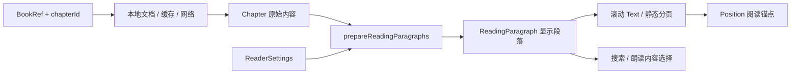

# 阅读器

[功能目录](README.md) · [文档首页](../README.md)

阅读器把原始章节按语言和译文偏好转换成显示文本，再交给滚动或分页布局。修改阅读器时，最重要的是保持**显示内容、阅读位置、搜索和朗读使用同一套语义**。

## 一章内容经过哪些步骤

| 修改内容 | 主要入口 |
| --- | --- |
| 阅读状态、工具栏、切章和位置保存 | [ReaderScreen.kt](../../app/src/main/java/cc/novelia/app/ui/reader/ReaderScreen.kt) |
| 下一章加载、失败与取消 | [ReaderChapterLoad.kt](../../app/src/main/java/cc/novelia/app/ui/reader/ReaderChapterLoad.kt) |
| 原文/译文投影 | [Paragraphs.kt](../../app/src/main/java/cc/novelia/app/reader/Paragraphs.kt)、[LocalParagraphs.kt](../../app/src/main/java/cc/novelia/app/reader/LocalParagraphs.kt) |
| 精确锚点与搜索位置 | [ReadingAnchors.kt](../../app/src/main/java/cc/novelia/app/reader/ReadingAnchors.kt) |
| 纯分页算法 / Android 测量绘制 | [StaticPagination.kt](../../app/src/main/java/cc/novelia/app/reader/StaticPagination.kt)、[EInkPage.kt](../../app/src/main/java/cc/novelia/app/ui/reader/EInkPage.kt) |
| 整本搜索 | [BookTextSearch.kt](../../app/src/main/java/cc/novelia/app/reader/BookTextSearch.kt) |
| 偏好控件 | [ReaderPreferences.kt](../../app/src/main/java/cc/novelia/app/ui/reader/ReaderPreferences.kt) |
| 后台朗读 | [ReadAloudService.kt](../../app/src/main/java/cc/novelia/app/reader/ReadAloudService.kt)、[SpeechContinuation.kt](../../app/src/main/java/cc/novelia/app/reader/SpeechContinuation.kt) |

## 设置如何生效

实际设置取 `bookSettings[ref.key] ?: reader`。单书设置是一整份快照；修改默认值不会同步修改已有单书快照，关闭“仅应用于这本书”才重新继承默认值。

语言、引擎、并列译文和简繁变化需要重新投影；字号、行距、段距与视口变化需要重新排版。昂贵计算放在 Default 调度器，滑块通常松手后提交，亮度等窗口效果在离开页面时恢复。

自动分页由 `paginationMode == "auto"` 决定，普通屏幕也能使用。电子纸切换通过 `withEInkMode` 保存和恢复两种模式的偏好，旧字段仍有兼容逻辑。不要只翻转布尔值绕过它。

正文翻页按钮、连续滚动章末按钮、电子纸列表翻屏按钮、点击区域翻页和进度条是独立设置。字段和默认值以 [ReaderSettings.kt](../../app/src/main/java/cc/novelia/app/data/model/ReaderSettings.kt) 为准；控件范围、备份校验与预设切换需一起修改。

## 章节加载和切换

首次进入由 `AppController.chapter` 读取本地文件，或优先读取网络章节缓存。强制刷新必须实际请求网络，失败不能伪装为刷新成功。

切章采用“先加载，成功后跳转”：

1. 当前正文保留在屏幕上，`ReaderChapterLoad` 请求目标章。
2. 同目标不重复请求，改选目标会取消旧任务。
3. 成功后检查请求代次、会话、缓存代次和发起的返回栈项。
4. 保存当前位置，传递预加载结果和目录状态，再切换阅读路由。
5. 失败显示重试或取消；离开页面取消待切章任务。

目录查询、倒序和切章标记通过导航状态传递，入场标记只消费一次。窄屏每次打开目录定位当前章，宽屏常驻目录保留浏览位置。

自动预读和手动离线缓存复用章节请求，数量、并发和落盘条件见[网络章节缓存](../network/network-and-sync.md#章节缓存和预读)。前台读到正文不一定表示离线副本已保存。

## 译文投影

在线章节按原文和各引擎段落数的最大值遍历，逐段选择内容：

- 非并列模式按 `engines` 顺序取首个可用译文；并列模式保留选中引擎的可用译文。
- `jp` 显示原文，`zh` 显示译文；`jp-zh` 和 `zh-jp` 决定双语顺序。
- 某段没有可用译文时回退原文，双语模式不会重复显示同一原文。
- 空段可从显示列表去掉，但保留原始段落索引；图片先识别为独立内容。
- 简繁转换只作用于译文，原文和日文回退保持不变。

本地 EPUB 的对照组由文件内容和可靠语言标记识别，独立于在线翻译引擎设置。已下载的多份译文保留；无法可靠配对的正文显示一次，不按奇偶段或文件名猜语言。解析和旧文件恢复见[文件与下载](files-and-downloads.md)。

## 阅读位置为什么不能只存页码

字号、方向或译文改变后，页码和像素位置都会变。阅读器保留段落与字符锚点来跨布局恢复，同时兼容原有列表位置。

| 坐标 | 含义 |
| --- | --- |
| `ReadingParagraph.index` | 原始段落索引；笔记 `Note.paragraph` 使用它 |
| 显示段落下标 | 投影列表中的位置；空段过滤后可能不同于原始索引 |
| `Position.index` | 兼容滚动列表的下标；第 0 项是标题，正文下标需加 1 |
| `textOffset` / `offset` | 段内显示字符偏移 / 当前滚动布局的像素偏移 |

例如原始第 2 段被过滤后，原始第 3 段在显示列表里会前移；把显示下标直接当笔记原始段号，就会跳错内容。

搜索命中的 `part/start/end` 相对于某份语言文本。转换为段内字符坐标时，还要加上双语换行、引擎标签和缩进。修改任何显示前缀，都要同步锚点计算和两种渲染器。

滚动模式等待真实文字布局后把字符换算为行位置；分页模式把字符锚点映射到测量页。语言或正文变化时优先保留同一原文段，失效的字符/像素偏移应清除。布局代次变化要取消旧定位任务，避免新文字套用旧几何信息。

## 进度、历史和查阅返回

滚动停稳后会防抖保存，分页变化、切章、返回和生命周期结束也保存。恢复锚点、重新排版或视口尚未就绪时不提交中间位置。

**暂停阅读历史仍保存续读位置。** 当前 [ReadingProgress.kt](../../app/src/main/java/cc/novelia/app/data/library/ReadingProgress.kt) 分开维护 `positions` 和 `readingHistory`；暂停或清空历史不清除位置。暂停时也不继续上报原站阅读历史。

书架全书进度按到达章节计算，章内进度按布局计算。进入最新已知章节可以显示 100%，但不等于用户手工标记“读完”。原站只上报章 ID，WebDAV 则可同步网络书籍的段落锚点，见[书架](library.md)和 [WebDAV](../network/webdav-sync.md)。

目录或搜索的首次实际跳转会保存临时 `ReadingReturnPoint`，供“回到刚才阅读处”。后续查阅保留同一起点，跨章返回成功后才消费它；这个临时位置不替代普通续读记录。

## 滚动、分页与输入

工具栏是正文上方的覆盖层，开关菜单和搜索框不改变正文视口，分页页码区也固定预留。否则每次开菜单都会重新分页。

| 模式 | 实现和交互 |
| --- | --- |
| 连续滚动 | LazyColumn；翻屏约移动视口的 85%；章末可上拉请求下一章 |
| 自动分页 | StaticLayout 测量整章，按完整行分页；插图独占一页；翻页复用布局 |
| 点击区域翻页 | 默认关闭；开启后左右三分之一翻页，中间切换工具栏 |
| 章内进度条 | 滚动按显示字符权重定位，分页选已测量页；两端不触发跨章 |

点击必须与长按选字、拖动、多指、图片操作和取消区分。章末上拉也只在有效手势松手时提交。电子纸与减少动效使用静态反馈；面板打开时不要拦截属于表单的按键。

## 搜索、图片和笔记

章内搜索针对实际显示文本，支持一段内多次命中。整本搜索读取本地文档或**已缓存的网络章节**，不会自动下载整本；没有完整离线目录时会降级并说明范围。结果数量和扫描量有上限，截断或缺缓存不能解读为全书没有命中。

图片在滚动正文预留位置，分页中独占一页。长按进入全屏查看，电子纸提供按钮操作。正文长按可选字、分享和记笔记；笔记保存原始段落索引，不能使用标题偏移后的列表下标。

## 系统朗读

朗读由 Android TTS 前台服务执行。服务按选定语言和同一投影规则建立句子队列，忽略图片；暂停后继续会重读当前句，不承诺字级恢复。

连续听书优先本地/缓存，只有开启联网续章时才读取缺失章节。失败暂停并保留目标供重试，空章可跳过，循环章节会停止。播放绑定开始时的会话，旧回调不能推进后来启动的新队列。

长正文先写私有临时队列文件，Intent 只传队列 ID，避免 Binder 大载荷。定时停止沿用一次播放的原期限，跨章、暂停和重试不会重置。真实语言包、音频焦点和通知按钮需要设备验收。

## 选择回归范围

纯规则优先看 `ReaderProjectionTest`、`ReaderPreferencesTest`、`ReaderExactSearchTest`、`StaticPaginationTest`、`ReaderChapterLoadTest`、`ReadingProgressUpdatesTest` 和 `SpeechContinuationTest`，位于 [JVM 测试目录](../../app/src/test/java/cc/novelia/app)。

布局与手势看 [ui/reader 设备测试](../../app/src/androidTest/java/cc/novelia/app/ui/reader)。至少检查滚动/分页互换、双语、大字号、横屏、工具栏开关、断网切章和后台再前台；锚点改动增加超长段落、空段和插图混排。执行方法见[测试指南](../quality/testing.md)。
