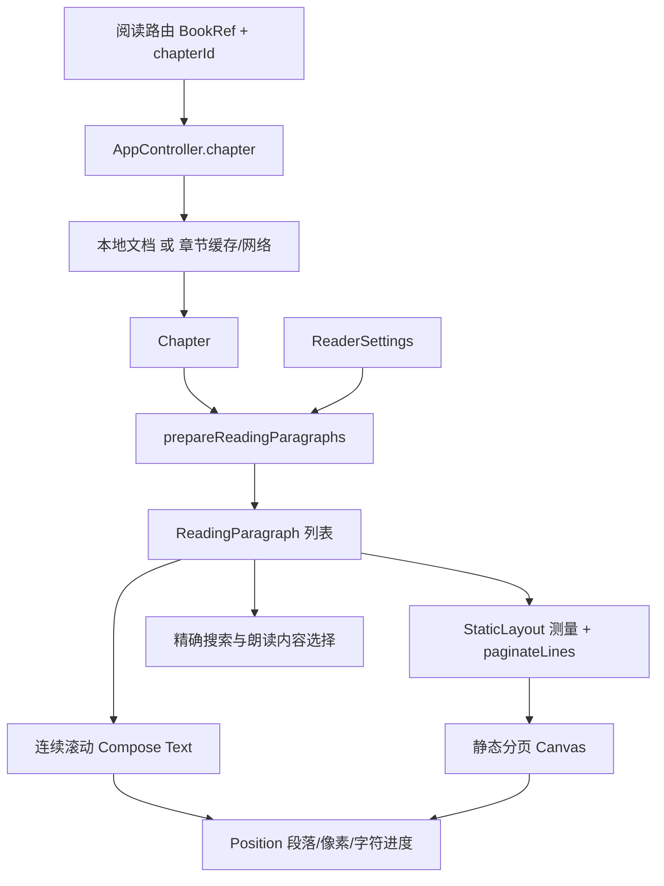

# 阅读器开发

[返回业务功能索引](README.md) · [文档总目录](../README.md)

本文描述当前阅读器的章节加载、正文投影、进度、分页、搜索、插图与朗读实现。一般 Compose 和导航约定见 [界面与导航](../architecture/ui-and-navigation.md)，返回 [开发文档首页](../README.md)。

## 1. 文件地图与数据流

| 文件 | 负责内容 |
| --- | --- |
| [ReaderScreen.kt](../../app/src/main/java/cc/novelia/app/ui/reader/ReaderScreen.kt) | 阅读状态协调、滚动正文、工具栏、设置、章节切换、搜索定位和生命周期 |
| [ReaderChapterLoad.kt](../../app/src/main/java/cc/novelia/app/ui/reader/ReaderChapterLoad.kt) | 保留当前正文的下一章节加载状态机 |
| [ReaderTocPane.kt](../../app/src/main/java/cc/novelia/app/ui/reader/ReaderTocPane.kt) | 目录显示、筛选、倒序和定位 |
| [ReaderPreferences.kt](../../app/src/main/java/cc/novelia/app/ui/reader/ReaderPreferences.kt) | 默认与单书共用的阅读偏好设置界面 |
| [Paragraphs.kt](../../app/src/main/java/cc/novelia/app/reader/Paragraphs.kt) | 原文/译文投影、逐段回退、图片标记、繁体转换 |
| [ReadingAnchors.kt](../../app/src/main/java/cc/novelia/app/reader/ReadingAnchors.kt) | 精确文本匹配、段内字符坐标、滚动行几何 |
| [StaticPagination.kt](../../app/src/main/java/cc/novelia/app/reader/StaticPagination.kt) | 纯 Kotlin 整行分页、字符锚点到页码、翻页键映射 |
| [EInkPage.kt](../../app/src/main/java/cc/novelia/app/ui/reader/EInkPage.kt) | 静态分页状态、Android 文字测量、Canvas 绘制 |
| [BookTextSearch.kt](../../app/src/main/java/cc/novelia/app/reader/BookTextSearch.kt) | 按实际显示文本搜索多章 |
| [OfflineReadingPanels.kt](../../app/src/main/java/cc/novelia/app/ui/reader/OfflineReadingPanels.kt) | 离线缓存范围和整本搜索 UI |
| [ReaderChapterOverscroll.kt](../../app/src/main/java/cc/novelia/app/ui/reader/ReaderChapterOverscroll.kt) | 滚动模式章末上拉切章 |
| [IllustrationViewer.kt](../../app/src/main/java/cc/novelia/app/ui/components/IllustrationViewer.kt) | 全屏图片查看 |
| [ReadAloudService.kt](../../app/src/main/java/cc/novelia/app/reader/ReadAloudService.kt)、[SpeechQueue.kt](../../app/src/main/java/cc/novelia/app/reader/SpeechQueue.kt) | 系统 TTS 前台服务和句子队列 |



`Chapter` 是服务端/本地读取模型，`ReadingParagraph` 是当前阅读偏好下的显示模型。原始章节不能因为切换语言或繁体而被覆写；搜索与显示应消费同一投影结果。

## 2. 阅读偏好及兼容边界

偏好界面分为“常用、翻页、更多”，低频设置按可展开分组展示。正文工具栏的翻页按钮由 `showPageButtons` 控制，连续滚动时章节末尾的下一章、下一分卷或返回目录按钮由独立的 `showScrollPageButtons` 控制；普通屏和电子纸均生效，关闭后仍可上拉进入下一章，且不影响电子纸列表/表单的翻屏按钮。交互控件保留至少 48dp 触控区域。

实际配置为 `local.bookSettings[ref.key] ?: local.reader`。开启“仅应用于这本书”会为当前书保存完整设置副本，关闭则删除副本、重新继承默认值。它不是逐字段继承模型；修改全局偏好不会自动更新已有单书副本。

[ReaderSettings](../../app/src/main/java/cc/novelia/app/data/model/ReaderSettings.kt) 包含以下相关配置：

| 类别 | 主要字段与含义 |
| --- | --- |
| 语言 | `mode`：`zh`、`jp`、`zh-jp`、`jp-zh`；`engines` 为优先序；`parallel` 为并列译文 |
| 排版 | `fontSize`、`lineHeight`、`paragraphSpacing`、`width`、`weight`、`indent`、`secondaryAlpha`、`underline`、`traditional` |
| 颜色/屏幕 | `theme`、`brightness`、`keepScreenOn`、`toolbarTransparency` |
| 分页/输入 | `paginationMode`、`showPageButtons`、`scrollPageTurn`、`horizontalPageTurn`、`volumeKeys` |
| 电子纸 | `eInkMode`、`beforeEInk`、`eInkPreferences` |
| 预读 | `prefetchChapters`、`prefetchWifiOnly` |
| 朗读 | `speechLanguage`、`speechRate`、`speechMinutes` |

`staticPagination` 仅判断 `paginationMode == "auto"`，不要把它等同于 `eInkMode`。电子纸首次开启使用自动分页和可用的翻页控制，关闭时恢复 `beforeEInk`，并保存电子纸内的选择供下次使用。旧字段 `paged`、`monochrome` 仍参与历史配置兼容；新增偏好应有默认值，调整这些字段前先读 [ReaderPreferencesTest](../../app/src/test/java/cc/novelia/app/ReaderPreferencesTest.kt)。

设置 UI 位于 [ReaderPreferences.kt](../../app/src/main/java/cc/novelia/app/ui/reader/ReaderPreferences.kt) 的 `ReaderPreferences`，由阅读器和 [SettingsScreen.kt](../../app/src/main/java/cc/novelia/app/ui/settings/SettingsScreen.kt) 复用。行距范围为 0.5–2.6，设置导入使用相同范围。段距单独设置为 0–32dp，默认 8dp；滚动正文按实际文字高度布局，不再强制保留 48dp 段落高度。滚动与分页模式共用段距，分页测量和绘制使用同一数值。中文模式只布局中文，不为隐藏的日文预留空间。普通滑杆先维护临时值，松手时再提交昂贵的排版变化；电子纸改用步进按钮。亮度和常亮标志只在阅读器中生效，并在 `DisposableEffect` 清理时恢复。

## 3. 章节加载、缓存与切换

### 首次进入

`ReaderContent` 通过 `AsyncContent(listOf(ref, chapterId), refreshKey = version)` 调用 [AppController.chapter](../../app/src/main/java/cc/novelia/app/ui/navigation/AppController.kt)。返回值为 `Pair<Chapter, Boolean>`，布尔值表示本地/缓存内容来源，不代表“内容最新”或“已经离线保存整本”。

- 本地书：读取文档索引与章节正文，构造 `Chapter`，前后章来自本地索引。
- 在线书：非强制刷新时先用现有章节缓存；缺失时通过 `chapterRequests.load` 共享请求。
- 显式刷新：`forceNetwork = true`；失败应呈现刷新失败，不能悄悄当作刷新成功继续使用旧缓存。
- 从同一阅读器预加载完成的切章可消费一次 `ReaderHandoff`，避免导航后重复请求。

在线请求与交接带有 `SessionBinding` 和 `cacheGeneration`。章节交接前检查当前账号会话和缓存代次，清理缓存或账号变化后不能把旧任务结果交给新的阅读器。

### 保留旧正文直到新章成功

`ReaderChapterLoad` 有 `target`、`loading`、`error`、Job 和内部 generation。选择下一章时先请求数据，成功后才保存当前进度并用 `readPreparedChapter` 替换阅读路由。失败时当前章留在屏幕上，用户可重试或取消。

必须保留的竞态保护：

1. 相同目标的在途请求不会重复启动；请求另一个目标会取消旧任务。
2. 被取消或代次过期的结果不能调用 `onLoaded`。
3. 成功回调还检查当前返回栈项是否为发起请求的阅读器。转场中的旧页面可能仍在组合，不能让它夺取新页面的标记。
4. 页面销毁时取消待切章任务。

切章通过新返回栈项的 `savedStateHandle` 传递菜单是否显示、目录查询/倒序/滚动位置、目录是否完成首次定位、上一章末尾标记和跨章搜索命中。目录首次加载后立即定位当前章，后续开关面板保留浏览位置，用户可用“定位当前”主动返回。每个标记消费一次，不能让普通刷新重复消费入场动作。

### 预读与译文更新

自动预读由 [ChapterOffline.kt](../../app/src/main/java/cc/novelia/app/data/chapters/ChapterOffline.kt) 执行。在阅读器生命周期达到 `STARTED` 后等待 600 ms，再按设置顺序读取后续章节。离开前台、取消协程或缓存代次变化时应停止；预读失败不能中断前台正文。

“本书有新的译文”根据缓存写入时间和所选引擎的更新时间判断，参见 [ChapterFreshness.kt](../../app/src/main/java/cc/novelia/app/data/chapters/ChapterFreshness.kt)。它是刷新入口提示，不意味着所有段落必定有新译文。手动刷新先记录当前锚点，再增加 `version`，成功重新投影后恢复位置。

## 4. 译文投影与逐段回退

[projectParagraphs](../../app/src/main/java/cc/novelia/app/reader/Paragraphs.kt) 遍历原文与各引擎段落数的最大值，而不是最短列表。每一个原始索引独立选择译文，因此部分翻译不会截断后续正文。

1. 引擎为 `sakura`、`gpt`、`youdao`，按去重后的 `settings.engines` 顺序处理。
2. 非并列模式选取该段第一个非空译文；并列模式保留所有可用的选中引擎译文。
3. `jp` 只显示原文；`jp-zh` 先原文再译文；`zh-jp` 先译文再原文。两种双语顺序都以中文为主、日文为辅助样式；默认中文模式显示译文。
4. 所选引擎都没有该段译文时显示原文，并置 `fallback = true`。双语模式此时不会把相同原文重复显示两遍。
5. 没有任何可见文本的段落不进入最终显示列表，但保留段落的原始 `index`。

图片在语言选择前识别：`<图片>http(s)://...` 产生 `imageUrl`，不合法地址成为“插图地址不可用”文本；`novelia-image:<64 位小写十六进制>` 产生 `localImageId`。本地图片 ID 只在本地书上下文中解析为文档图片。

`prepareReadingParagraphs` 在投影后 trim 显示文字，并按需用 ICU `Simplified-Traditional` 转换译文。日文及原文回退不会被转为繁体。每次准备单独创建转换器，避免共享可变 ICU 对象；大文本按不拆分代理对的 4096 字符块处理，并定期检查取消。

UI 在 `Dispatchers.Default` 执行正文准备，依赖章节和语言/引擎/并列/繁体变化。字号和视口变化应触发排版，不必重新做语言投影。增加新译文引擎时需要同步更新模型、引擎映射、来源标签、设置 UI、搜索与朗读的选择行为。

## 5. 三种段落索引与字符锚点

阅读器最容易出错的是把下列坐标混用：

| 坐标 | 定义与用途 |
| --- | --- |
| 原始段落索引 | `ReadingParagraph.index`；对应 `Chapter` 原文/译文数组；笔记 `Note.paragraph` 使用它 |
| 投影列表下标 | `paragraphs` 的零基下标；跳过空段后可能不同于原始索引；搜索 `ReadingTextMatch.paragraph` 和 `PageLine.paragraph` 使用它 |
| 滚动列表下标 | `LazyColumn` 第 0 项是标题，正文第 n 段位于 `n + 1`；`Position.index` 保存这套兼容位置 |

`Position` 还包括滚动像素偏移 `offset` 和段落显示文本的 `textOffset`。静态分页保存 `paragraph + 1` 和页首字符偏移；滚动模式同时保存当前列表项、像素位置和测量到的字符位置。单纯保存页码在字号、宽度或方向变化后没有稳定含义。

书籍列表的全书进度使用可选的 `chapterIndex`（零基）、`chapterCount` 和 `paragraphCount`。章节等权，章内按已越过的展示段落估算；滚动到底或自动分页到末页时，单独保存 `chapterCompleted`，将本章计为已读完，仍保留屏顶／页首恢复锚点。完成最新已知末章后清除新增章节提示及阅读时间之前已发现的译文更新提示，保留译文缓存刷新时间、独立的分卷更新和更新检查基线；已读到末章的旧记录进入应用时自动清理残留标识，阅读之后才发现的译文更新仍会提醒，不自动将整书状态改为“读完”，后续新增章节仍正常提示。目录从已有缓存或本地索引异步读取，不为计算进度发起额外请求。旧本地及挂载分卷记录缺少进度元数据时，后台读取本地目录及当前章补齐，保留原位置和阅读时间；文件不可用时仍显示“继续阅读”，不猜百分比。

云端列表只有 `lastReadAt` 时显示“有阅读记录”，不绘制伪造的 0% 进度条；收藏接口未填充这个字段，空值只能视为未知。取得详情中的章节 ID 和目录后，直接显示“读到第 X 章”，同一章节号按 `X / 总章节数` 填充进度条，不再单独添加云端标签；这是读到的位置，达到最后一章不等于手工标记读完。云端元数据保存所属账号和是否已解析详情，不能在登出或切换账号后串用，也不会覆写本机 `Position`。云端收藏和云端历史的文案、进度条统一使用云端记录。本地书架有时间戳时优先较新的记录；云端详情没有阅读时间戳时，采用更靠后的章节，同章保留本机段落精度；本地手工标记“读完”仍优先。已登录但尚未取得云端元数据且没有本机位置时显示“云端进度待同步”，不判为全局未读。本地网络书架、云端收藏和云端历史会为可见条目异步补齐章节元数据，复用已有详情缓存，最多并发两个请求，失败保留已知进度。

静态分页中同一原文段的多个语言版本用单换行连接，整段能放入一页时保持同页；超长段仍按完整行跨页。双语顺序或译文内容变化后恢复同一原文段开头，避免继续使用语义已改变的拼接字符偏移。

`ReadingTextMatch` 的 `part/start/end` 相对于某一语言/译文文本，**不包括缩进**；`textOffset()` 再通过 `paragraphPartStarts()` 加上两段间换行、并列引擎标题及两个全角缩进空格，变成分页和滚动可共享的段内坐标。修改任何标签、换行或缩进时，两个渲染器和这套坐标计算都要同步。

滚动文字通过 `onTextLayout` 与 `onGloballyPositioned` 记录每一行的 start/end/top。`ParagraphScrollLayout` 使用这些几何信息在字符和像素之间转换。跳转搜索结果时先挂载对应懒加载项，等待所有文字 part 的布局，再滚动到目标行；工具栏遮挡只影响目标定位偏移。

布局代次 `layoutGeneration` 覆盖文字、字号、行距、段距、宽度、缩进、并列、粗体、分页模式和阅读视口宽度。搜索不能继续等待已被丢弃的几何数据，所以代次销毁时取消等待中的搜索 Job。

### 保存与恢复时机

- 滚动停稳后防抖 500 ms 保存；分页状态变化、切章、返回、`ON_STOP` 和销毁也会保存。
- 暂停阅读历史时不保存进度；未测量完成、正在恢复锚点、分页模式切换中或已离开时也不提交临时位置。
- 未改变的章 ID、索引、像素、字符和标题不会重复写入。
- 滚动与分页切换时使用段落+字符锚点，不直接套用原来的像素偏移。
- 临时视口尺寸变化时保留原请求锚点，不能每次测量都将它改成中间页的页首，否则会逐次向前漂移。
- 同一行的实际起始字符可能早于请求字符；用户尚未移动时保留请求字符，避免切回另一渲染器时退一整页。

云阅读历史目前上传章 ID，本地 `Position` 保存更细粒度的位置。不要将两者描述为完整的逐字符云进度同步。

## 6. 连续滚动和静态分页

### 固定正文视口

两种模式都使用稳定的正文视口，顶部/底部工具栏是同级覆盖层。显示菜单、收起菜单或展开章内搜索不会参与正文尺寸计算；分页模式还固定预留页码栏空间。修改工具栏时不要把它改成给正文动态增加 padding 的布局，否则会改变页数和阅读位置。

阅读器宽屏使用固定目录栏，窄屏使用目录面板。阅读区宽度仍受 `settings.width` 限制，正文安全区域考虑系统栏及刘海。

### 连续滚动

正文使用有稳定原始索引键的 `LazyColumn`，标题、正文、图片和章末有各自的 `contentType`。普通翻屏按钮移动视口高度约 85%；减少动效时直接移动，否则使用短动画。

章末上拉由 [ReaderChapterOverscroll.kt](../../app/src/main/java/cc/novelia/app/ui/reader/ReaderChapterOverscroll.kt) 接管列表在末尾剩余的拖动距离，阈值 56 dp。仅未中断的单指触摸在松手时可提交；多指、指针取消、选择手势和禁用修饰符不能触发切章。列表原生 overscroll 关闭，避免先吞掉末尾距离。测试新手势时必须覆盖“达到阈值后取消”和“反向撤回”。

### 自动分页

1. `measureEInkChapter` 为每段建立 `SpannableStringBuilder` 和 `StaticLayout`，保留字号、粗体、行距、辅文本字号/透明度/下划线。
2. 将文字布局转为不可拆分的 `PageLine`，再交给纯函数 `paginateLines`；只分完整行，段落之间加入间距。
3. 插图独占一页，空正文仍产生可处理的空页。超过视口高度的单行由渲染器缩放显示，避免大字号横屏截掉文字。
4. `EInkPageState` 保存页列表、页索引、就绪状态和待恢复字符锚点。
5. Canvas 绘制当前页的已测量行，并提供可读取的可见文字语义。

测量在 `Dispatchers.Default` 执行，后续变化有 120 ms 合并等待；翻页只切换索引，复用整章布局。输入键包含内容、排版、视口、密度和字体缩放。旧测量结果只有在输入相符、页列表实例匹配时才能显示，避免短暂把新文字和旧布局拼在一起。

触摸翻页在抬手时按主要方向提交，阈值 40 dp。左右/上下手势可以分别关闭。当前页前后越界分别进入上一章末尾、下一章开头；本地挂载文库分卷在最后一章后提示下一分卷。`readerKeyDirection` 还映射 PageUp/PageDown、方向键、空格和可选音量键；设置、搜索、朗读等面板打开时阅读器停止拦截不该消费的按键。

## 7. 精确搜索

### 章内搜索

`findReadingTextMatches` 搜索已经准备好的显示文本，忽略大小写，按投影段落、part、出现位置排序；支持同一段的多次命中和重叠匹配，最多 2000 条，跳过插图。上/下一处从当前命中继续；没有当前命中时参考真实可见字符位置，而非只参考段号。

搜索计算在后台执行，定位回到主线程。查询或投影变化会清理旧匹配；布局变化取消旧定位 Job。修改这些代码时，需要验证同一超长段落中多次命中、双语辅文本、并列译文、繁体转换、缩进和图片前后的偏移。

### 整本搜索

[BookSearchPanel](../../app/src/main/java/cc/novelia/app/ui/reader/OfflineReadingPanels.kt) 是离线范围搜索：

- 本地书读取本地目录与章节。
- 在线书读取当前账号的离线目录快照及已缓存章节，不为搜索请求缺失章节。
- 没有离线目录时降级到当前缓存章节，并在界面说明范围。

`searchBookText` 同样调用 `prepareReadingParagraphs`，默认上限为 200 个结果、20,000,000 个已扫描文本字符。它返回扫描章数、可用章数、目录总章数和 `truncated`，结果为空不能被解释成全网小说没有命中。跳转结果携带 `paragraph/part/start/end`，到目标章后按真实布局定位并高亮。

## 8. 插图与笔记

滚动插图先预留宽度 1.35 倍、限制在 180–900 dp 的显示框，下载解码完成后不会推动后续段落。静态分页中插图独占一页。两种模式都有失败重试和长按放大入口。

[IllustrationViewer](../../app/src/main/java/cc/novelia/app/ui/components/IllustrationViewer.kt) 将解码尺寸限制为 4096×4096，使用 [IllustrationTransform.kt](../../app/src/main/java/cc/novelia/app/reader/IllustrationTransform.kt) 处理缩放中心和平移边界。普通模式支持捏合/拖动、双击与按钮；电子纸使用缩放及方向按钮，避免连续手势绘制。视口变化时重置变换。

段落长按面板支持系统文本选择、分享和创建笔记。笔记保存 `BookRef.key`、章节 ID、原始段落索引、文本摘录及可选笔记，并附书名/章节名。它不是 `Position.index`，不要用滚动列表的标题偏移污染笔记定位。

## 9. 系统朗读

朗读采用 Android `TextToSpeech`，由 [AndroidManifest.xml](../../app/src/main/AndroidManifest.xml) 中的 `ReadAloudService` 前台服务提供后台播放。当前功能朗读本章，不会自动网络抓取并连续朗读下一章。

开始时按当前显示段落选取起点。日文模式使用原始段落索引从原文截取；中文或译文朗读从投影列表截取每段的第一段主文本。设置的 `speechLanguage` 为 `auto` 时依据显示模式是否以 `jp` 开头选择日文。

`prepareSpeechQueue` 忽略空白和图片标记，按句号、问号、感叹号、换行等切分句子，每个 utterance 最多约 3500 个字符，并避免切断 UTF-16 代理对。暂停/恢复重读当前句子，不承诺从句中某个字精确恢复。

长正文不放进 Intent extras：后台先写私有缓存目录的 `tts-queue-<UUID>.json`，服务只接收队列 ID。服务立即升为前台，再在 IO 线程读取并删除文件；准备取消和异常也负责清理文件。更改这部分不能把整章通过 Binder 传递。

服务用全局请求代次和唯一 utterance ID 隔离旧回调；新的开始/停止后，旧 `onDone` 不能推进新队列。它管理音频焦点、通知暂停/继续/停止按钮、定时停止、TTS 语言包检查和销毁清理。`status` 是供 UI 观察的 `StateFlow`。系统引擎或语音包缺失应显示失败原因，不应误报“本章朗读完成”。

## 10. 修改步骤与测试矩阵

修改阅读器时先选择真实边界：纯文本/分页规则放在 `reader/`；章节和缓存操作保留在数据/控制器层；Compose 负责状态协调与呈现。避免把可独立测试的规则继续堆进 `ReaderContent`。

| 修改范围 | 优先运行/扩展的测试 |
| --- | --- |
| 原文、译文回退、繁体 | [ReaderProjectionTest](../../app/src/test/java/cc/novelia/app/ReaderProjectionTest.kt)、[ReaderAndLinksTest](../../app/src/test/java/cc/novelia/app/ReaderAndLinksTest.kt) |
| 偏好迁移、电子纸切换 | [ReaderPreferencesTest](../../app/src/test/java/cc/novelia/app/ReaderPreferencesTest.kt)、[EInkReaderFlowTest](../../app/src/androidTest/java/cc/novelia/app/ui/reader/EInkReaderFlowTest.kt) |
| 切章取消/失败/重试 | [ReaderChapterLoadTest](../../app/src/test/java/cc/novelia/app/ReaderChapterLoadTest.kt) |
| 章末上拉 | [ReaderChapterOverscrollTest](../../app/src/test/java/cc/novelia/app/ReaderChapterOverscrollTest.kt) |
| 分页、锚点、翻页键 | [StaticPaginationTest](../../app/src/test/java/cc/novelia/app/StaticPaginationTest.kt)、[ReaderExactSearchTest](../../app/src/test/java/cc/novelia/app/ReaderExactSearchTest.kt) |
| 精确搜索、边界/取消、朗读队列 | [ReaderExactSearchTest](../../app/src/test/java/cc/novelia/app/ReaderExactSearchTest.kt)、[ReaderSafetyTest](../../app/src/test/java/cc/novelia/app/ReaderSafetyTest.kt) |
| 阅读连续性和分卷 | [ReadingContinuityTest](../../app/src/test/java/cc/novelia/app/ReadingContinuityTest.kt)、[ReadingContinuityUiTest](../../app/src/androidTest/java/cc/novelia/app/ui/reader/ReadingContinuityUiTest.kt) |
| 工具栏不改变排版 | [ReaderToolbarOverlayTest](../../app/src/androidTest/java/cc/novelia/app/ui/reader/ReaderToolbarOverlayTest.kt) |
| 宽屏目录、窗口调整 | [ReaderAdaptiveUiTest](../../app/src/androidTest/java/cc/novelia/app/ui/reader/ReaderAdaptiveUiTest.kt) |
| 图片缩放和平移 | [IllustrationTransformTest](../../app/src/test/java/cc/novelia/app/IllustrationTransformTest.kt)、[IllustrationViewerTest](../../app/src/androidTest/java/cc/novelia/app/ui/reader/IllustrationViewerTest.kt) |

例如只验证纯阅读规则，可在仓库根目录用 PowerShell 7 执行：

```powershell
.\gradlew.bat :app:testDebugUnitTest --tests 'cc.novelia.app.ReaderProjectionTest' --tests 'cc.novelia.app.ReaderExactSearchTest' --tests 'cc.novelia.app.StaticPaginationTest'
if ($LASTEXITCODE -ne 0) { throw '阅读器单元测试失败' }
```

交互变化还应在模拟器或真机验证：连续滚动/自动分页互换、普通/电子纸、窄屏/宽屏/横屏、大字号、菜单和键盘开关、后台再前台、离线切章失败后重试，以及长段落和图片混排。涉及朗读时另验证真实系统 TTS 的语言包、焦点变化和通知按钮。单元测试不能替代实际文字测量、窗口尺寸或系统服务行为验证。
