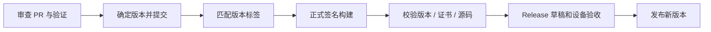

# 发布与长期维护

[维护目录](README.md) · [文档首页](../README.md)

正式命令和签名操作统一在[手动发布指南](releasing.md)维护。本页说明维护者需要长期保持的关系：**发行包、源码、版本、证书和验证记录必须互相对应。**

## 从改动到发行

版本只从 [version.properties](../../version.properties) 读取。维护者递增版本码，汇总 PR 到 Release 正文；当前没有独立 CHANGELOG，也没有自动发布工作流。

本地打包允许未提交代码，默认本地 Release 使用测试签名。正式附件准备要求干净工作区、匹配标签和长期证书，两者用途不同。

发行附件清单见[准备附件](releasing.md#准备附件)，变更说明单独填写在 Release 正文。一次本地 APK 构建成功不代表正式签名、附件收集及设备验收均已完成。

## 长期保留哪些材料

正式 APK、精确提交的源码、许可证、校验文件、元数据和 Release 说明一起交付。R8 mapping 与对应版本长期归档，用于还原混淆堆栈；正式私钥另行安全备份，不作为附件。

发布后修复使用新版本，保留旧标签与附件的可追溯性。签名变化、备份格式变化和最低系统版本变化，应在升级说明中明确写出。

## 依赖与素材

[open-source-notices.gradle.kts](../../gradle/open-source-notices.gradle.kts) 根据 Release 运行时依赖生成完整说明，并进入 APK 的离线许可证页。更新依赖后重新生成、人工检查缺失的全文和来源，方法见[许可维护](../../licenses/README.md)。

第三方角色、贴纸和网站内容不由项目 GPL 重新授权。发行前核对 [NOTICE.md](../../NOTICE.md) 中的来源和适用授权；不能由代码中已经使用或旧待办消失推断已获许可。

## GitHub 协作和故障处理

Issue 表单、PR 模板和 CODEOWNERS 在 [.github](../../.github)。它们不证明服务器端保护已经启用，维护者按[设置清单](../../.github/REPOSITORY_SETUP.md)核对权限和合并规则。

处理问题先记录版本、设备和复现入口，参照[排障指南](troubleshooting.md)。涉及损坏、会话隔离或恢复时，先保留最小合成回归夹具；公开日志脱敏。安全问题按 [SECURITY.md](../../.github/SECURITY.md) 私密处理。

旧论坛部署与测试记录在[历史归档](history/forum-adaptation.md)，不作为当前提交的验收结果。
