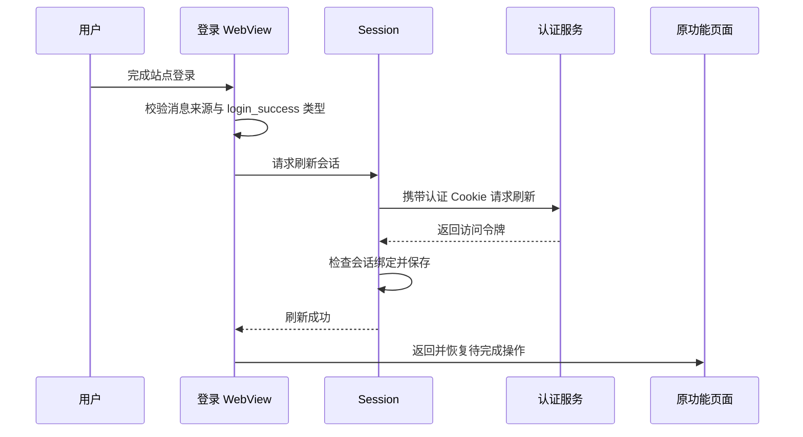

# 账号、登录与会话隔离

[返回网络与同步索引](README.md) · [文档总目录](../README.md)

本页聚焦从登录界面到认证请求的完整路径。API 端点、缓存、云端写入队列和重试策略见[网络与同步](network-and-sync.md)，本地资料范围见[数据存储](../data/data-and-storage.md)。

## 1. 登录链路

设置可在原站和 `book.xkvi.top` 镜像之间切换。下述 WebView 链路适用于原站；镜像使用原生表单调用同源 `login`、`register`、`otp/request`，成功时接收直接返回的 JWT，或携带认证 Cookie 请求 `refresh?app=n` 获取 JWT。镜像入口 Cookie 由打包配置注入并自动携带，不能与账号 JWT 混用。完整协议和配置见[反代镜像书源](../development/book-source-mirrors.md)。

[LoginScreen.kt](../../app/src/main/java/cc/novelia/app/ui/account/LoginScreen.kt) 使用 WebView 展示原站认证流程。当前代码的页面基准来源为 `https://n.novelia.cc`，其中的认证 iframe 指向 `https://auth.novelia.cc/?app=n&theme=system`。

网页消息只触发刷新，不被当作凭据。若设备支持的 WebView 功能或网页回调存在差异，用户可以点击“完成登录”走同一刷新流程。刷新失败时仍停留在登录流程并提示错误，不仅凭网页显示成功就进入已登录状态。

## 2. WebView 的边界

网页中转脚本核对认证来源及消息类型。原生 `addWebMessageListener` 只接受配置的来源，并继续检查主 frame、HTTPS、来源主机及消息内容；不支持该能力时不建立宽泛的 JavaScript 接口作为替代。

登录 WebView 启用 JavaScript、DOM 存储与认证所需 Cookie，接受 iframe 所需的第三方 Cookie；禁用文件/内容访问及混合内容。主页面导航只在允许的 HTTPS 站点内继续，其他 HTTPS 页面交给外部入口。子 frame 和资源加载有各自规则，不能把主页面导航白名单描述成所有网络资源都被同一白名单限制。

修改网页桥接或站点地址时，应同时检查脚本来源校验、原生监听来源、导航策略和认证刷新请求。不要为排障关闭 TLS 检查或扩大来源到任意域名。通用站内页面的 WebView 与登录 WebView 是不同入口，详见 [UI 与导航](../architecture/ui-and-navigation.md)。

## 3. 登录后继续操作

[LoginContinuation.kt](../../app/src/main/java/cc/novelia/app/ui/navigation/LoginContinuation.kt) 将“登录后收藏”的具体书籍意图保存到登录导航条目的 `SavedStateHandle`，使页面重建后仍能恢复。登录成功后移除并消费该意图，再返回原页面显示云端收藏流程。

其他临时续接行为由 `afterLogin` 管理。成功消费、取消登录和离开页面时要清理回调，避免下一次登录误触发旧页面操作。用户完成登录不代表原操作已经写入云端：收藏仍需走自己的选择、排队和同步流程。

## 4. 令牌保存与用户信息

[Session.kt](../../app/src/main/java/cc/novelia/app/data/auth/Session.kt) 将访问令牌使用 Android Keystore 中的 AES-GCM 密钥加密，保存到应用私有首选项。书架 JSON、普通设置 JSON 和阅读资料 ZIP 不承担凭据保存。

客户端解析 JWT 中的用户名、角色、注册时间与过期时间用于本地状态及界面判断。这一步不是服务端签名验证，也不能作为服务端授权依据；`canPost`、`canEdit` 和管理员入口只是用户交互条件。

Cookie 属于 WebView/认证服务的会话材料，不能和访问令牌、设备书架混为一谈。不要在日志、截图、测试夹具或问题反馈中记录它们的实际值。

原站 JWT 沿用 `session`；镜像 JWT 和认证 Cookie 独立保存到 `session-xkvi` 并经 Keystore 加密。镜像不借用原站已有登录令牌；首次使用需要重新登录。切回已有登录的线路可以恢复该线路的会话，退出仅清除当前线路的会话。

## 5. 为什么请求需要绑定会话

[SessionState.kt](../../app/src/main/java/cc/novelia/app/data/auth/SessionState.kt) 用 `SessionBinding(account, generation, source, sourceRevision)` 标识请求发起时的身份。账号区分用户，登录代次及来源代次区分退出重登和书源切换；即使用户名相同、切走再切回同一来源，旧请求也不能跨越变化继续提交。

| 场景 | 预期处理 |
| --- | --- |
| 同一账号正常令牌刷新 | 保持会话归属，更新令牌 |
| 多个请求同时收到 401 | 刷新锁合并续期；已经获得新令牌的请求不重复刷新 |
| 请求期间退出登录 | 旧绑定失效，旧响应不能重新写回登录状态 |
| 请求期间切换账号或书源 | 返回“账号或书源已变化”，不能自动改绑后再发送 |
| 退出后重新登录同一账号 | 新代次使退出前的请求失效 |

[NoveliaApi.kt](../../app/src/main/java/cc/novelia/app/data/network/NoveliaApi.kt) 在鉴权请求中捕获绑定、读取对应令牌，并在请求和响应的关键边界核对绑定。401 触发的认证刷新与重试受限，不是无限重试；重试继续使用原绑定。

添加新的鉴权请求时应复用现有网络入口，避免从全局状态临时读取“现在的用户”后，把旧操作发送给后来登录的账号。下载等自定义响应处理也必须维持相同边界。

## 6. 退出登录与保留资料

退出登录先使本地会话失效并清理相应凭据/Cookie，再尝试远端退出请求。这样即使网络慢，旧刷新也不能把退出状态覆盖回去；远端退出响应不能清除随后建立的新登录。

本地书架、进度、笔记、草稿、下载和本地文档仍属于本设备。章节缓存也不是按账号分别保存；元数据缓存及云端待办则带有账号归属。退出后还能看到本地资料是当前设计，不能据此判定退出失败。

账号 A 的待同步操作不会转给账号 B 执行。切换账号后的同步处理、暂停原因和清理规则见[网络与同步](network-and-sync.md)。

## 7. 排查与验证

| 现象 | 核对方向 |
| --- | --- |
| 登录页面无法加载 | WebView 可用性、设备时间、认证服务连通性与当前页面来源 |
| 网页成功但客户端仍未登录 | 消息是否到达、手动完成登录是否成功、刷新返回状态 |
| 反复 401 | Cookie/令牌有效期、刷新失败路径、是否确实仍属于当前绑定 |
| 编辑入口存在但返回 403 | 服务端权限条件；不要修改客户端判断来绕过拒绝 |
| 账号变化提示 | 原操作是否跨越退出/切换，使用当前账号重新操作 |
| 退出后仍有书籍与笔记 | 设备资料正常保留；检查账号状态而非清空书架 |

自动回归入口是 [SessionIsolationTest](../../app/src/test/java/cc/novelia/app/data/auth/SessionIsolationTest.kt)、[ApiContractTest](../../app/src/test/java/cc/novelia/app/ApiContractTest.kt) 和 [BoundCloudSyncTest](../../app/src/test/java/cc/novelia/app/data/sync/BoundCloudSyncTest.kt)。[AuthPageTest](../../app/src/androidTest/java/cc/novelia/app/integration/AuthPageTest.kt) 是显式启用的页面联调，不填写真实凭据，也不能证明真实账号完整登录已验收。
